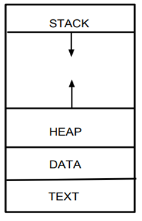
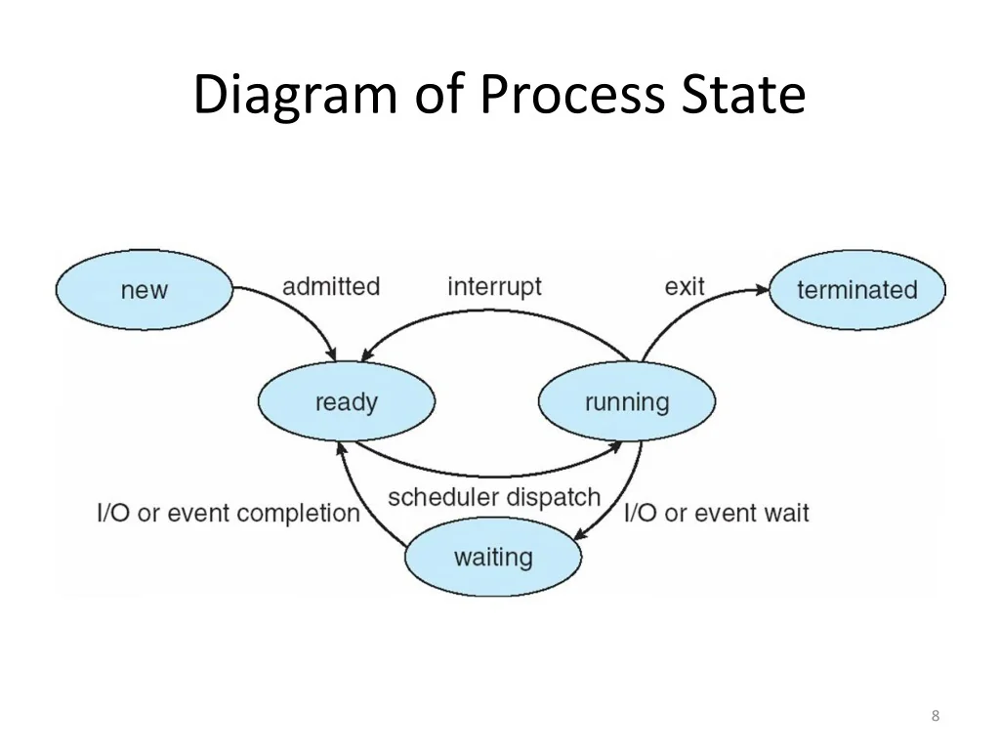
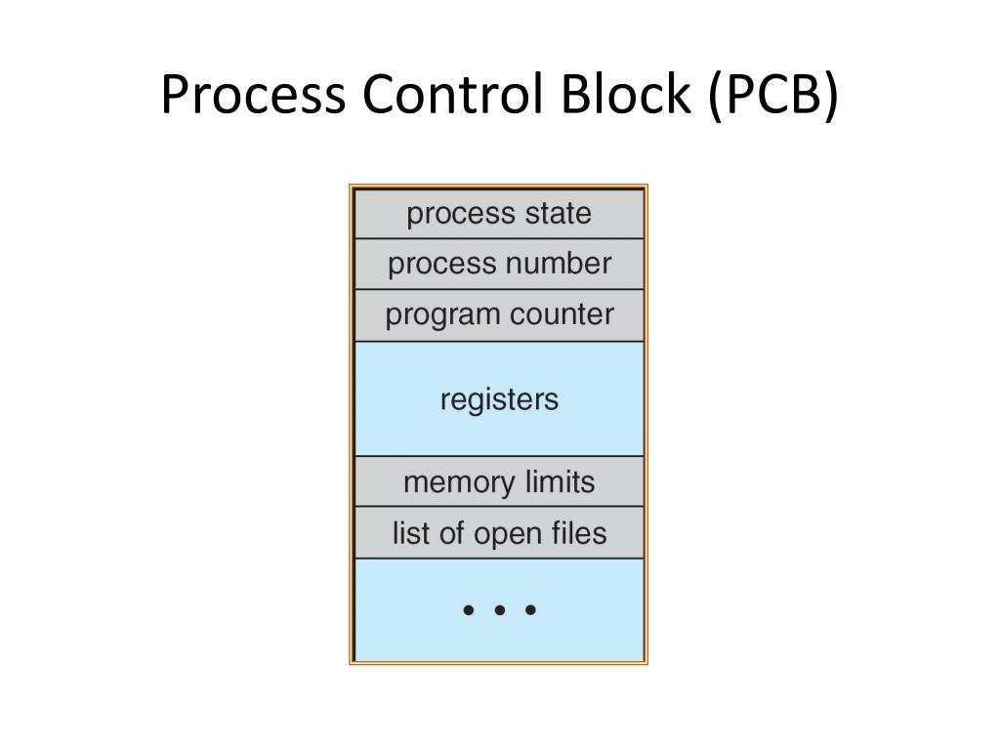

# Operating Systems
---

**Aurthor**: Harsha Vardhan

---

## 🚀overview:
  In this Documentation we will mainly focus on

1. Fundementals
  - Evolution of OS
  - System Components
  - OS Architectures
  - Boot Process

2. Process Management
  - Process Concept
  - Threads
  - CPU Scheduling
  - Inter-Process Communication

3. Process Synchronization
  - Critical Section Problem
  - Synchronization Tools
  - Classic Problems
  - Deadlocks

4. Memory Management
  - Basics
  - Contiguous Allocation
  - Non-Contiguous Allocation
  - Virtual Memory

5. Storage & File Systems
  - File Concept
  - Directory Structure
  - File System Implementation
  - Mass-Storage Structure
  - Disk Scheduling

6. I/O Systems
  - Hardware
  - Communication
  - Kernel I/O Subsystem
  - Device Drivers

---

## 1. Fundamentals

### 1.1 Evolution of OS:

| Era | Focus | Key Technology |
| :--- | :--- | :--- |
| 1940s | Bare Machine | Switches & Wires |
| 1950s | Job Automation | Batch Processing |
| 1960s | CPU Utilization | Multiprogramming |
| 1970s | User Interaction | Time-Sharing (UNIX) |
| 1980s | Accessibility | GUI (Windows/Mac) |
| Modern | Connectivity | Mobile & Cloud |

### 1.2 System Components:
  Basically in systems components there comes the shell , the system libraries and the kernal
  - Shell (Outer Layer):  
  it is the **user Interface** of the operating system . It is the actually part us the human see and interact with  
  Its job is to take our input, understand it and pass into deeper system like **CLI and GUI**.
  
  - System Libraries (The Middleman):  
  The programs **directly cant talk to the kernel** because the kernel language is very complex so instead we use system Libraries
  - Kernel (The Heart):  
  It is the core of the OS and it has complete control over everything in the system, it starts when the computer boot and ends when it shuts down untill then it stays in the memory  
  It has the control over resource management and privilage mode  
  Resource Maangaement:It decides which proccess gets the cpu and RAM it can use and handles data storage  
  Priviliged Mode: kernel runs in **Kernel Mode** means it can do any thing in the system and this is a protected area if the normal app(user mode) crashes, the system still stays up and if the kernel crashes the blue screen appears

### 1.3 OS Architectures:
  - Monolithic Kernels:  
  in this the entire operating system including device drivers, file systems, and network stacks—runs in a single address space within the kernel.  
  mechanism: Components communicate through direct function calls.  
  adv: High performance  
  dis: f one driver crashes, the entire system will go stop
  - Microkernels:  
  in this it minimizes the kernel to the absolute essentials: address space management, thread scheduling, and Inter-Process Communication and remaining the drivers and file systems in user mode  
  mechanism: When a user application needs a file, the microkernel acts as a postman  
  adv: High reliability and security.
  dis: Slower than monolithic kernels
  - Hybrid Kernels:
  in this it tries to combine the speed of a monolithic kernel with the modularity of a microkernel.  
  mechanism: It keeps a microkernel-like structure but allows **servers** to run inside the kernel's address space.
  adv: Balanced performance and stability.

|Feature| Monolithic | Microkernel | Hybrid|
| :--- | :--- | :--- | :---|
| Kernel Size |	Large |	Very Small |	Medium |
| Execution |	All in Kernel Mode |	Mostly User Mode |	Mixed|
| Stability |	Lower (One fail = Crash) |	High (Isolate fails)	| Medium/High |
| Performance	| Maximum	| Lower (IPC overhead)	| Balanced |

### 1.4 Boot Process :  

---

## 2. Process Management

### 2.1 Process:  
  **Mainly the process is known as the program in execution** .  
  The layout of process in memory
    
  1. Text: the executable code
  2. Data: the global variables
  3. Heap: memory that dynamically allocated during program run time
  4. Stack: temporary data storage when invoking functions(eg: local variables etc..)  
  We can observe that the text and data sections are fixed while heap and stack sections are not because they can grow dynamically during program execution.  
  A program becomes an process when an executable file is loaded into memory.  
  Even if the two processes may associated with the same program they are considered as two seperate execution sequence.

  - Process State:  
  As a process executes, its state changes. the state of process is defined in part by the current activity of that process.
  In this there are states  
  1. New: the process is being created
  2. Running: Instructions are being executed  
  3. Waiting: the process is waiting for event(ex: I/O completion of signal)  
  4. Ready: the process is waiting to assigned to a processor
  5. Terminated: The process has finished execution  
    
    
  - Process Control Block:  
  In OS each process is represented by a process control block(PCB) which is also known as task control Block . it has many specific process blocks like  
  1. Process state: the state may be new,ready,running,waiting.....  
  2. Program counter:This indicates the address of the next instruction to be executed for this process.  
  3. CPU Registers: This is used when an interrupt occours  it allows the process to be continued correctly afterward when it rescheduled to run.  
  4. CPU Scheduling Information: This includes the process priority, pointers to scheduling queues etc  
  5. Memory management information: it stores the information like page tables, segment tables etc based on the memory system  
  6. Acounting Information: this has the amount of **CPU and realtime used** etc.  
  7. I/O status information: this has the list of input output devices allocated to the process, a list of open files etc  

  